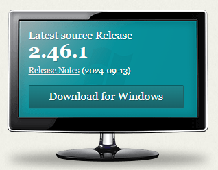
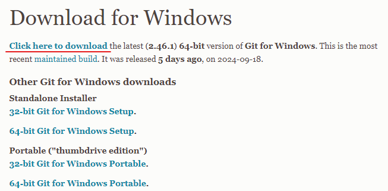
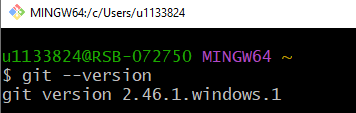

# Introduction

This notebook will guide you how to install Git on your device, including Windows, MacOS, and WSL guidelines. It is highly recommended that you use Git in a terminal environment, such as the Terminal in your MacOS system or WSL (Windows Subsystem for Linux) in your Windows system.

If you want to install WSL in your Windows laptop, please follow this [tutorial](https://documentation.ubuntu.com/wsl/en/latest/guides/install-ubuntu-wsl2/).

If you don't have any experience with Linux, you can still use Git in your Windows system, please follow my tutorial for Windows user below. 

# Windows User

### 1. Download Git 

* Visit the official Git website at https://git-scm.com/ 
* Click on __Download for Windows__. 



* Then click on __Click here to download__, the download should start automatically. 



### 2. Run the installer 

* Once the download is complete, open the downloaded `.exe` file to run the installer. 

### 3. Follow the installation wizard 

* You will be greeted with a setup wizard. Click __Next__ to continue through the steps. 
* __Select Destination Location:__ Choose the default location or select a different folder to install Git. Click __Next__.
* __Select Components__: Leave the default settings and click __Next__.
* __Select Start Menu Folder__: Leave the default and click __Next__.
* __Choosing the default editor__: Select your preferred text editor (like Notepad++ or VS Code). Click __Next__.
* __Adjusting the name of the initial branch in new repositories__: Select "Let Git decide". Click __Next__.
* __Adjusting your PATH environment__: Select "Git from the command line and also from 3rd-party software". Click __Next__. 
* __Choosing the SSH executable__: Choose "Use bundled OpenSSH". Click __Next__. 
* __Choosing HTTPS transport backend__: Choose "Use the OpenSSL library". Click __Next__.
* __Configuring the line ending conversions__: Select "Checkour Windows-style, commit Unix-style line endings". Click __Next__. 
* __Configuring the terminal emulator to use with Git Bash__: Select "Use MinTTY (the default terminal of MSYS2)". Click __Next__.
* __Choose the default behavior of `git pull`__: Choose "Fast-forward or merge". Click __Next__. 
* __Choose a credential helper__: Choose "Git Credential Manager". Click __Next__. 
* __Configuring extra options__: Tick "Enable file system caching" and "Enable symbolic links". Click __Next__. 
* __Configuring experimental options__: Leave the experimental options unticked.

### 4. Complete the Installation

* Click __Install__ to begin the installation.
* After the installation completes, click __Finish__. 

### 5. Verify Installation

* Open the __Command Prompt__ or __Git Bash__ (which was installed with Git).
* Type `git --version` and press __Enter__. If Git is installed, you'll see the version of Git displayed. 



# MacOS User

* Check if you have Git installed. Open Terminal and type in `git --version`. If it returns you a version number, it means you have Git installed. If it returns "couldn't find Git", it means you don't have Git. 
* Install [homebrew](https://brew.sh/) if you don't already have it.
* Then, open __Terminal__, and run `brew install git`. 
* Type `git --version` in __Terminal__ to verify. 

# WSL User

* Check if you have Git installed. Open Ubuntu WSL and type in `git --version`. If it returns you a version number, it means you have Git installed. If it returns "couldn't find Git", it means you don't have Git. 
* Run the below commands:

```
sudo apt update
sudo apt install git
```

* Run `git --version` to verify if Git is installed. 