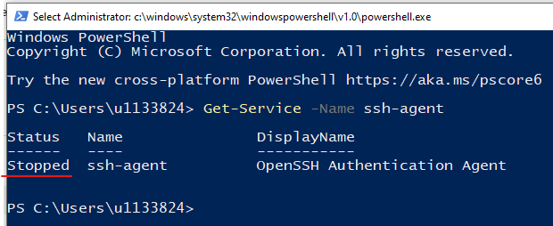

# Learning Module 1 - Introduction to Git & GitHub Basics

## Outline

1. Introduction to Version Control - __be simple!!!__
    * What is version control?
    * Local vs. remote repositories 
2. Installing Git and GitHub Setup
    * Git installation
    * Create a GitHub account
    * Configure SSH keys for authentication
3. Basic Git Commands
    * Introduce the basic Git workflow: __initialise__, __add__, __commit__, and __status__. 
    * Check commit history. 
4. Use GitHub as remote repositories
    * Create a GitHub repository 
    * Connect the local repository to GitHub repository - `git remote add`
    * Push changes to GitHub - `git push`
    * Commit changes online from GitHub
    * Pull changes from GitHub - `git pull`

# 1. Introduction to version control 

### What is version control?

Version control is a system that helps manage and track changes to files over time, allowing multiple people to collaborate on projects efficiently. It enables users to keep a history of changes, revert to previous versions, and manage multiple versions of a project simultaneously.

### What is Git & GitHub?

__Git__ is the most popular distributed version control system in use today, and __GitHub__ is a platform that hosts Git repositories in the cloud. 

### Local repositories

A local repository is a repository that exists on your local machine. You can initialise a Git repository using `git init`.

### Remote repositories

A remote repository is a repository that is hosted on a server or cloud-based platform, allowing you to collaborate with others by pushing and pulling changes to and from the cloud. 

Popular remote repository providers include __GitHub__, __GitLab__, and __Bitbucket__. 


# 2. Installing Git and GitHub setup

### Installing Git

This part I have included in the file "01_installation.md", you can refer to that notebook to install Git on your laptop. If you still have questions installing, there will be a free exercise session later and I can help you install. 

### Creating GitHub account

If you haven't create one, please go to [github.com](https://github.com/) and sign up for one. 

### Setting up SSH keys

Secure Shell Protocol (SSH) is a cryptographic protocol used for secure communication between two devices over an unsecured network. 

Using the SSH protocol, you can connect and authenticate to remote servers and services. With __SSH keys__, you can connect to GitHub without supplying your username and personal access token at each visit. 

Now I will guide you through how to set up SSH keys for your GitHub account and on your local device. 

1. Generating a new SSH key. 
    * Open Git Bash/Terminal. 
    * Paste the text below, replacing the email used in the example with your GitHub email address. Press __enter__. 

    ```
    ssh-keygen -t ed25519 -C "your_email@example.com"
    ```

    * You will be prompted up a message saying "Generating public/private ed25519 key pair" and asking "Enter file in which to save the key (/c/Users/username/.ssh/id_ed25519):". Remember the path and press __enter__. You may need to access the SSH key later, that's why we need to remember the path. 
    * Then, another message pop up asking "Enter passphrase (empty for no passphrase)". We leave it empty. Press __enter__.
    * The same message pop up again, we do the same. Press __enter__. 
    * A message like below pops up saying keys have been saved. Normally you shouldn't give your key to anyone else, this is an example key and I won't use it. 

     

2. Adding your SSH key to the ssh-agent
    * Open a new __admin elevated PowerShell__ window. 
    * Run `Get-Service -Name ssh-agent`, this command is to check if the ssh-agent is running. 

    

    * Run `Get-Service -Name ssh-agent | Set-Service -StartupType Manual`.
    * Run `Start-Service ssh-agent`. These two commands will start the ssh-agent in the background. 
    * If you run `Get-Service -Name ssh-agent` again, you will see the status has changed to "running".
    * In a __terminal window without elevated permissions__, add your SSH private key to the ssh-agent. Run `ssh-add /c/Users/YOU/.ssh/id_ed25519`. Make sure the path is where you created your SSH key. 

3. Adding your SSH public key to your GitHub account
    * Open Git Bash, run `cat /c/Users/YOU/.ssh/id_ed25519.pub`, then your SSH public key will be displayed on the screen, copy the key. 

    

    * Click your __profile photo__ at the top-right part of your GitHub page, and go to __Settings__ page of your GitHub account. 

    
    
    * Click __SSH and GPG keys__.
    
    

    * Click __New SSH key__. 

    

    * Input a __title__ and paste the key to the text box. Click __Add SSH key__.

    

Until now, you have successfully created a SSH key and connect your GitHub account with your local device. You will be able to push and pull things to/from GitHub now without the needing to input username and passcode every time. There is one more step to do, which is "auto-launching ssh-agent". 

4. Auto-launching ssh-agent on Windows

If you are a MacOS user, you can skip this step. 

This step enables the auto-launching of ssh-agent, then you don't need to start ssh-agent every time.

* Open Git Bash.
* Run `nano ~/.bashrc`.
* Copy the following code and paste it to the end of the file. 

```
env=~/.ssh/agent.env

agent_load_env () { test -f "$env" && . "$env" >| /dev/null ; }

agent_start () {
    (umask 077; ssh-agent >| "$env")
    . "$env" >| /dev/null ; }

agent_load_env

# agent_run_state: 0=agent running w/ key; 1=agent w/o key; 2=agent not running
agent_run_state=$(ssh-add -l >| /dev/null 2>&1; echo $?)

if [ ! "$SSH_AUTH_SOCK" ] || [ $agent_run_state = 2 ]; then
    agent_start
    ssh-add
elif [ "$SSH_AUTH_SOCK" ] && [ $agent_run_state = 1 ]; then
    ssh-add
fi

unset env
```

* Press __Ctrl + X__, then press __Y__ for "save modified buffer", then press __enter__ for "file name to write". 

Now, we have done everything for setting up SSH keys. 

# 3. Basic Git commands 

### Initialise a git repository - `git init`

A git repository is essentially a project folder, where this folder stores everything about your project including your data, code script, documentation, a README file, and images etc. Inside this project folder, we can run `git init` to convert this folder to a git repository. 

First, let's create a new folder for our project. 

* Create a new folder on __Desktop__ and name it as __"first-repo"__. 


* Open __first-repo__ folder, and create a new file called __"README.md"__.
    * The README file is necessary for every git repository. Normally, the README file include information relevant to your project, the README file can provide an introduction of your project to the audience. 
    * You can __right click__, then __new__, then choose __text document__ to create a .txt file.
    * And change the name of the txt file to __"README.md"__.


* Open __README.md__ file using Notepad or any text editor (Notepad++, VS Code). 
* Add the following information to your __README.md__ file. Then __save and exit__.

``` 
# My first git repository

This is my first git repository, I will use this repository to learn and practise git command. 
```

Now, our project folder has one file. Let's try to convert it to a git repository. 

* Inside folder __first-repo__, __right click__, choose __open git bash here__. The git bash should be launched. 
* Then type `git init` and press __enter__ to run. You should see following informaiton. 


Now, our project folder should be a git repository. 

### Add changes - `git add`

Once we initialise a git repository, the repository is still empty, git won't add everything inside the folder automatically, we have to add it manually. To add files and file changes, we can use `git add`. 

For now, we only have one file we want to add, which is the README file. 

* We can run `git add README.md` in git bash terminal. If there is no error pops up, meaning we have added the change successfully.
* We can also use `git add .` to add all modified changes, the `.` means all. 

### Check git status - `git status`

So after adding changes, we can check the current git status to see what changes we have made to git so far. 

* Run `git status`. You will see the following information. 


### Commit changes - `git commit`

From the above information, we can see messages "on brach master", "no commits yet", and "changes to be commited". This message tells us we have added the README file as changes, but it hasn't commited. 

In git, we have to do both `git add` and `git commit` to save changes. In this way, after we commit the changes, git will save those changes to a "version", and in the future we can go back to each commit to view the changes or we can rollback to a certain version. 

Now, let's commit our changes. 

* Run `git commit -m "add README"`. When we commit changes, a commit message is necessary. The commit message should be a brief message explaining the changes. Here, we use `-m` option then followed by the message we want to add. The message should be enclosed by a pair of double quotes __""__. 
* You will see a message indicating you have successfully commit changes. 


### Check commit history - `git log`

We can check commit history using `git log`.


It gives information about the __commit id__, __commit authour__, __commit time__, and __commit message__. 

We can also use `git log -p` to see commit history and the changes introduced by each commit. See below. 


# 4. Use GitHub as remote repositories

As we mentioned earlier, GitHub is a web-based platform for storing Git repositories. It is also a good platform to share your work with others. 

### Create a new repository in your GitHub account

The first step we need to do in order to "upload" our local projects to Github is to create a new repository in our GitHub account. On the __home__ page of your GitHub, click __new__ in the left pane. 


Then, you will see the below page. 


Choose the exact same options as what I chose in the photo. Then click __Create repository__. You will be guided to the below page. 


### Add remote repository

This step needs to be done in your local terminal. Open __Git Bash__ or __Terminal__, and do the following. 

* Go to your local Git repository `cd ~/Desktop/first-repo`
* Copy and paste the line of `git remote add origin ...` from the page, and run it in your terminal. The address in the end is different for each person, you should copy from your GitHub page.  
* Run `git branch -M main`. This step renames your current branch to `main`, the default brach name. 

### Push local repository to github 

This step we need to use the `git push` command. Run `git push -u origin main`, and you will see the following information. 


Type __yes__ and press __enter__ to continue. You will see the following information, means that you have successfully pushed your repository to github.


After you pushed the repository, you can go to github website to check your `first-repo` repository to see if it has changed. Below is how my `first-repo` repository looks like after I pushed from local. You can see that the README file we previously added has shown on the web page. 


### Commit changes online from GitHub 

Besides from adding changes from your local repository, you can also add changes on github directly. Here, we will add a few more changes in our README file. 

* On your `first-repo` github page, click into the README file. 
* On the top-right of the web page, click __edit__. See image below for the location of the __edit__ button. 


* You will go into a text editor interface, and you can type and edit the README file. Please add the following text to your README file. 

```
## Practice 1 

Edit the README file from GitHub, and commit changes. 
```

* On the top-right, click __commit changes__. There will be a pop up window like below. 


* Keep the commit message "Update README.md" and choose "Commit directly to the main branch", then click __Commit changes__.

### Pull changes from GitHub

We have added two lines of code to the README file on GitHub, but our local repository hasn't has the change yet. This situation can also happen when someone else in your group has pushed some changes he made to the GitHub repo, and you want to sync the changes with the latest GitHub version. 

To update your local repository with the changes updated to GitHub or any remote repository, you can use `git pull`

* Run `git pull` in your terminal. 


You will see the above information saying the changes has been pulled. 


