# Learning Module 2 - Branching and Merging 

## Outline 

1. Braching 
    * What is a branch?
    * Why use branches?
    * Basic Git branch commands.
        * List branches
        * Create a new branch
        * Switch to a branch 
        * Push the new branch to GitHub 
2. Merging
    * What is merging?
    * Types of merging
    * Merge conflicts
    * Basic Git merge commands
        * Merge a branch into another
        * Resolve conflicts 
        * After resolving conflicts 
3. Pull Requests in GitHub
    * What is a pull request in GitHub?
    * Open a pull request
    * Code review
    * Merge the pull request 
        * Create a merge commit
        * Squash and merge
        * Rebase and merge 
4. Handling merge conflicts in GitHub
    * Fetch the latest changes
    * Merge the conflicting branch
    * Resolve the conflicts 
    * Mark the conflicts as resolved and commit
    * Push the resolved branch 
5. Best practices for branching and merging
    * Keep branches short-lived
    * Frequent commits
    * Pull often
    * Descriptive branch names 
    * Use pull requests 

# 1. Branching 

## What is a branch in Git?

The default branch in Git and GitHub is called `main` (previously called `master`). You will be on this branch by default if you initialise a Git repo and start to make and commit changes, the commits you have made would be on this default `main` branch as well. In Git, you can create and work on different branches for different purpose, and eventually merge them. 

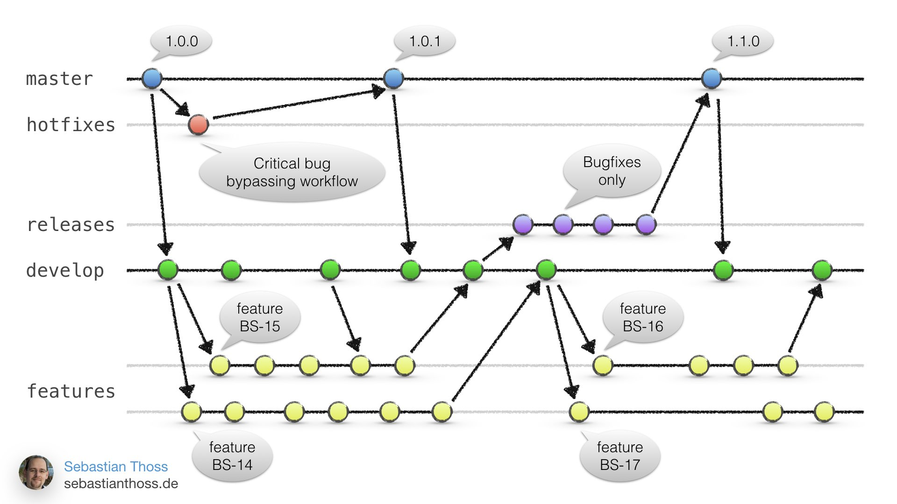

## Why use branches?

Using branch add a safety layer to your project development. Working on a branch can avoid introducing damaging code to your main development. Branches are normally used for purposes like:

* __Developing features:__ You can work on new features without disturbing the main code. 
* __Fixing bugs:__ You can create a branch to fix a bug, then merge it back into the main branch when it's fixed. 
* __Code reviews:__ Teams often use branches to propose changes, have those changes reviewed, and then merge them once they are approved. 

## Basic Git branch commands 

Before we start to work on branching and merging, let's copy an existing repository that I have developed to your local device. `git clone` is a command where you can copy a remote repository to your local device, including the repo's code, version history, branches. 

Before you clone the repository, decide which folder on your local device you would like to store this repo. Then move to that folder before you run `git clone` command. I decide to put my repo on desktop, so I run:

```sh
cd /c/Users/u1133824/Desktop/
git clone https://github.com/adrbmdns/collaborative-website.git 
```

Then, you will see a new folder has been added to your desktop. This repository is for a small website project for you to practise. Inside this folder, there are two files `index.html` and `styles.css`. The `index.html` file stores code that structure a webpage. If you use a browser to open this file, you will see a webpage. If you use a text editor to open it, you will see the code. Please use browser to open the `index.html`. You will see a page like below. 


If you move your mouse cursor to "About Us", "Contact", or "Gallery", you will see these are links you can click. Please click "About Us". It says "File not found". That is because there should be another HTML file for this "About Us" page, but we don't have it inside our `collaborative-website` page. And here as we learn branching of Git, we will develop this "About Us" page as well. 

### 1. Create a new branch - `git branch <branch-name>`

To create a new branch, we use command `git branch <branch-name>`. Let's name our new branch as "about-page", means we use this branch to develop the "About Us" page. Let's run the following to create the branch:

```sh
git branch about-page
```

After this, we won't be switch to the new branch automatically, we have to switch it manually. 

### 2. Check current branch and list all branches - `git branch`

Some terminals will detect Git environment and display the current branch in the prompt line. Like Git Bash, you will see a pair of bracket at the end of the prompt and displays which branch you are currently on. Like the below image:

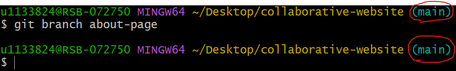

To list all branches we have for this Git repo, we can run `git branch`:

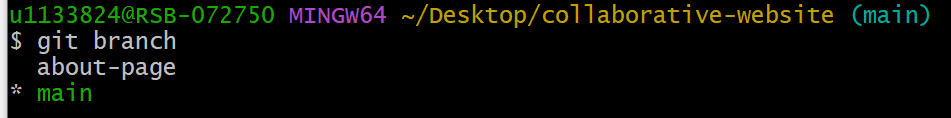

From the above image we can see that we have two branches `main` and `about-page`, and the one with a `*` sign at the front is the branch we are currently on. 

### 3. Switch branches - `git checkout <branch-name>`

So to switch to the `about-page` branch, we can run:

```sh
git checkout about-page 
```

After we switched to branch `about-page`, we can start to write the HTML page of "About Us". To do that, you can create a file called `about.html`, and paste the following code into the file, and save the file. You can choose to create this `about.html` file in the File Explorer by creating a new text file and rename it to `about.html`, or you can choose to create the file in command line by running `nano about.html`. Then paste the following to the nano editor, and press __ctrl + x__ to save and exit. 

```html
<!DOCTYPE html>
<html lang="en">
<head>
    <meta charset="UTF-8">
    <meta name="viewport" content="width=device-width, initial-scale=1.0">
    <title>About Us</title>
    <link rel="stylesheet" href="styles.css">
</head>
<body>
    <h1>About Us</h1>
    <p>This website is created by a team of awesome collaborators.</p>
</body>
</html>
```

After we saved the HTML file, we can now add the change to our current branch `about-page` by running:

```sh
git add about.html
```

You may see the following information after you ran the command. It is a warning message and won't have any impact on we adding the file to git. 

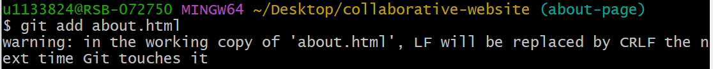

After we have add the changes, we can check the status of the git repo to make sure the file has been added to Git. By running the following:

```sh
git status
```

You will see the following information:

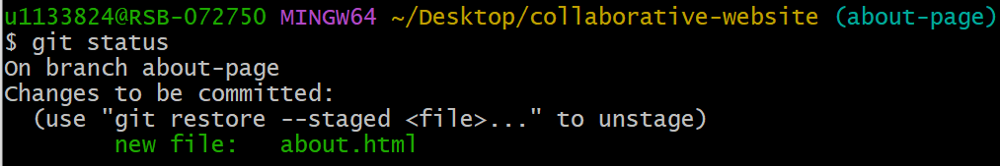

It shows that the `about.html` has been added. Then we can continue to commit our changes to Git repo by running:

```sh
git commit -m "Add About Us page"
```

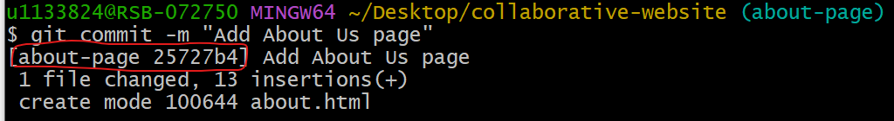

We can see that this time we commit, the message showed to us means that we have made this commit to the branch `about-page` and with a commit ID 25727b4. Now our branch tree should look like this:

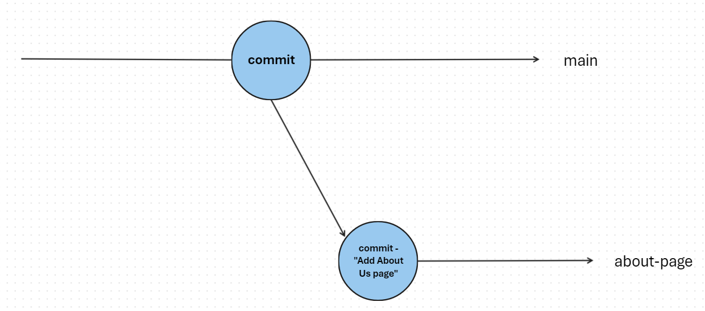

### 4. Merging branches - `git merge`

Now we have two branches in our Git repo, as we have finished the development in the branch `about-page`, now we can merge it into `main`. To merge a branch into `main`, first we need to switch to `main`.

```sh
git checkout main
```

Then, in branch `main`, we can run the following code to merge branch `about-page` to `main`.

```sh
git merge about-page
```

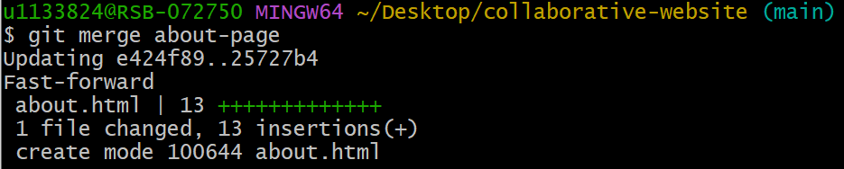

If there is no conflict, the merge will be successful. If there are conficts, you have to resolve the conflicts first and then try to merge again. Here, we don't have conflict so the merge has been successful. After merging, the branch `main` will be updated, we can choose to push it to GitHub so it has a copy on the cloud. 

```sh
git push origin main
```

If you try the above command, you will see a different result than mine. If you remember, the repository on your device is cloned from `https://github.com/adrbmdns/collaborative-website.git`, which this repository is stored under the account __adrbmdns__, which is my GitHub account. If you make a push request, you're actually trying to push your modified repo to my GitHub account, and here will request another layer of authentication which is to check if your GitHub account has access to my GitHub repo, if I the repository owner didn't grant you access, you won't be about to push anything to the GitHub repo. We will talk about how to work collaboratively on a GitHub repo later. 

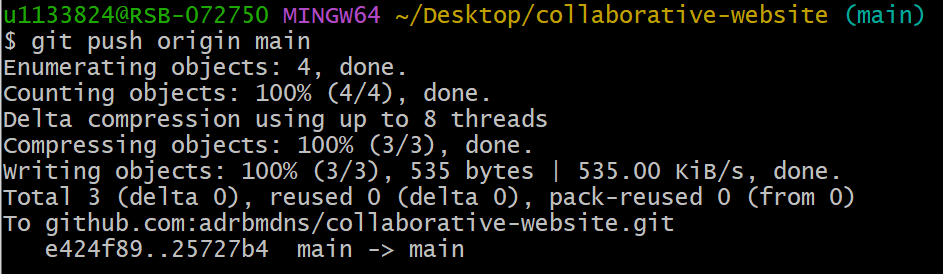 

After merging, the branch tree of our Git repo will look like this:

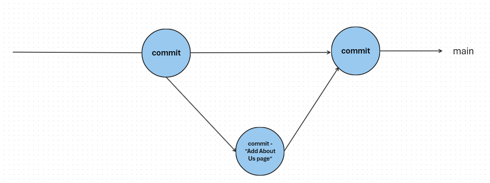

### 5. Fork a GitHub repository 

The above branch merging is one way we can merge branch, it requires we have both rights to make changes on a branch and on the `main` branch. But it is not the same way if you work within a group, normally you don't have access to make changes on the `main` branch, a group leader will review your code first before merging your branch to the `main` branch. On GitHub, if your group leader wants to merge your branch to the `main` branch, they will launch a __pull request__. The launch of __pull request__ need to be done on GitHub rather than your local git repository. 

To practise a __pull request__, you need to fork the abovementioned `collaborative-website` repo of user __adrbmdns__ to your GitHub account. Then you will have full access to the `collaborative-website` repo that is under your own account, you will also be able to push any changes on your local device to GitHub. You will have the access to practise __pull request__ as well. 

Steps to fork a GitHub repository:
* Go to the repository you want to fork on GitHub. Here is https://github.com/adrbmdns/collaborative-website 
* Find the __fork__ button and click. The button looks like below:

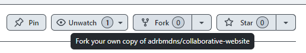

* Wait for GitHub to fork the repository. It normally takes some time to create the copy to your GitHub account, make sure to refresh after a few minutes and check if there is a repo called `collaborative-website` under your account. 
* After forking, go to the repo on your own account, and clone it to your local device. Here, you might encounter a problem, because you already have a folder called `collaborative-website` on your __desktop__. So to avoid any errors, please delete the previous folder and then do the `git clone`.

### 6. Pull request 

So we have forked a GitHub repo to our account and cloned it to our local device, now we are going to create a new branch called `contact-page` and in this branch we will write a HTML file about the "Contact" page. To create the new branch:

```sh
git branch contact-page
```

To switch to the new branch:

```sh
git checkout contact-page
```

In this new branch, let's create a file called `contact.html` and input the following code in:

```html
<!DOCTYPE html>
<html lang="en">
<head>
    <meta charset="UTF-8">
    <meta name="viewport" content="width=device-width, initial-scale=1.0">
    <title>Contact Us</title>
    <link rel="stylesheet" href="styles.css">
</head>
<body>
    <h1>Contact Us</h1>
    <p>Email us at: info@collaborativewebsite.com</p>
</body>
</html>
```

After creating this HTML file and making changes, let's add and commit the changes:

```sh
git add contact.html
git commit -m "Add Contact page"
```

After adding and committing the changes, we can push the branch `contact-page` to GitHub. This way, it won't change anything on the `main` branch, but it also create a copy of the `contact-page` branch on our GitHub repo. 

```sh
git push origin contact-page
```

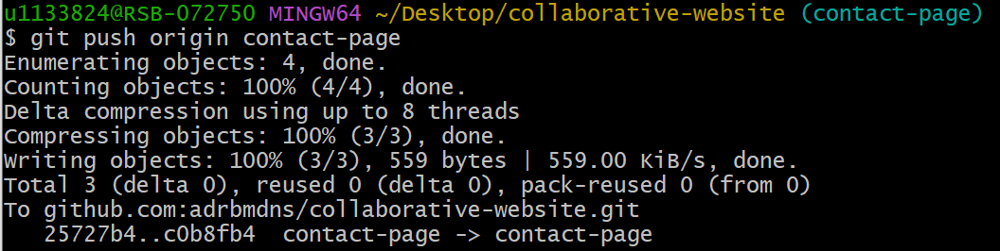

After pushing branch `collaborative-website` to GitHub, go to GitHub, you will see a message saying "branch xxx has recent pushes":

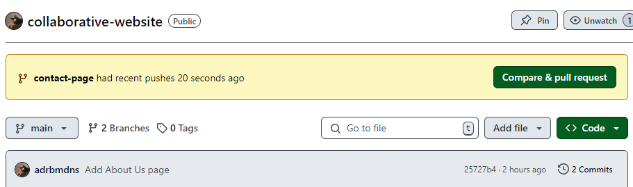

Now, as the developer, you can create a pull request, then your group leader can receive the pull request, review your code, and decide if they want to merge it to the `main`. Click on the __Compare & pull request__ button. 

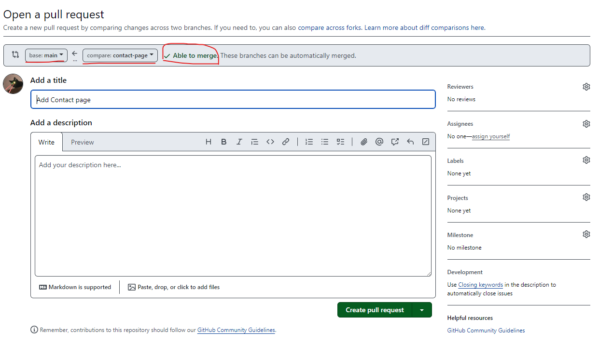

We can see that on this page, you can choose which branch you want to merge and which branch you want to merge into. There is also a message telling you are these two branches be able to merge? If it says __Able to merge__, there isn't any conflicts. If you scroll down on the webpage, you can see the detail of this pull request and what has been changed. 

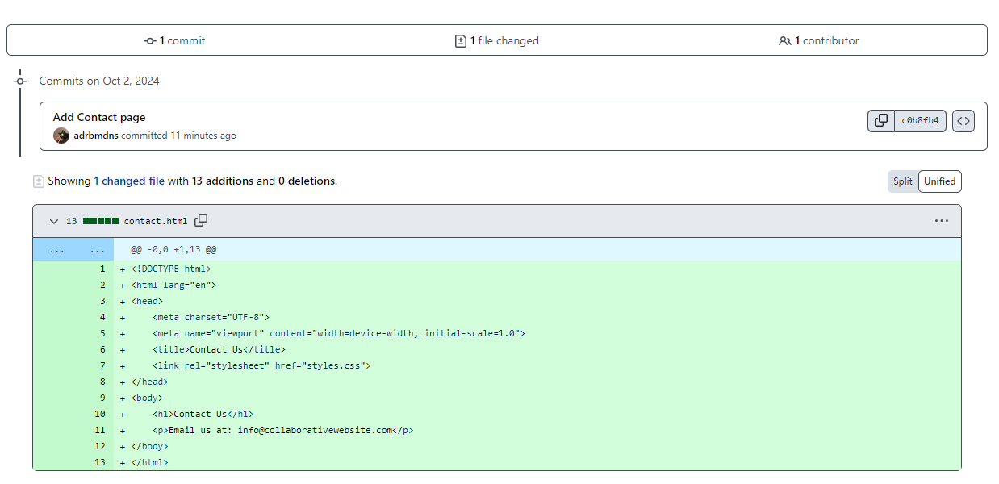

__Green__ means added lines. Now, let's input the title as "Add Contact page" and add a description "Add new feature". Click __Create pull request__. You will be guide to the below page. 

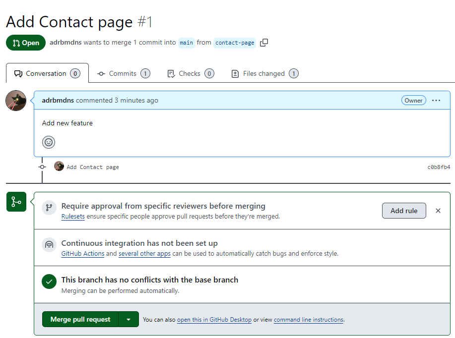

__Pull request__ now is available to others in your project to view, and available to project owner to view and make comments on your pull request, or the project owner can decide if they want to merge your pull request. Now, imagine yourself is the project owner, and you have reviewed this pull request submitted by one of your group member. There are no errors, and you are going to merge the pull request. Click __Merge pull request__.

After successfully merging the pull request, GitHub will ask you if you want to delete the merged branch since now it has no use to the project. 

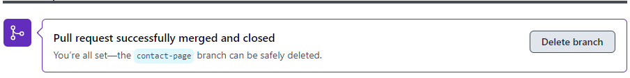

Let's delete the branch. Click __Delete branch__. 

## Handling merge conflicts in GitHub 

Merge conflicts can happen when you trying to merge two branches, two different changes happend in the same line of a file, resulting in a conflict. In this case, we need to decide which change to keep, and resolve the conflict manually. Below is a scenario where how things can happen resulting in a merge conflict. 

__Let's assume two people are working on different branches:__
* __One person on the `main` branch modified the `index.html` file.__
* __Another person on the `about-page` branch made different modifications to the same section of `index.html`.__

When trying to merge the `about-page` branch into `main`, a conflict will arise. Let's create the conflict first:

1. Switch to branch `main`:

```sh
git checkout main
```

2. Modify `index.html` according to below:

```html
<h1>Welcome to the Collaborative Website!</h1>
<p>This is the main branch version of the introduction.</p>
```

3. Commit the changes:

```sh
git add index.html
git commit -m "Modify introduction in main branch"
```

4. Switch to the `about-page` branch and make different changes to `index.html`. 

```sh
git checkout about-page
```

Edit `index.html`:

```html
<h1>Welcome to the Collaborative Website!</h1>
<p>This is the about-page branch version of the introduction.</p>
```

5. Commit the changes:

```sh
git add index.html
git commit -m "Modify introduction in about-page branch"
```

6. Push both branches to GitHub:

```sh
git push origin about-page
git checkout main
git push origin main
```

7. Go to GitHub and navigate to your `collaborative-website` repository. 
8. Switch to the branch `about-page`.
9. Create a pull request to merge `about-page` to `main`.
10. After creating pull request, open the pull request and click __Resolve conflicts__. 

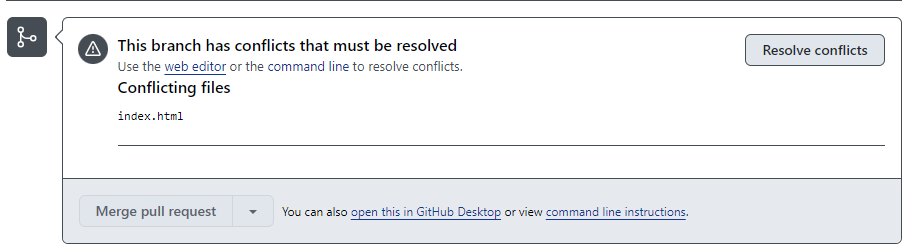

11. Once you click __Resolve conflicts__, GitHub will show you a __conflict editor__ with the conflicting parts of the file marked. Like below:

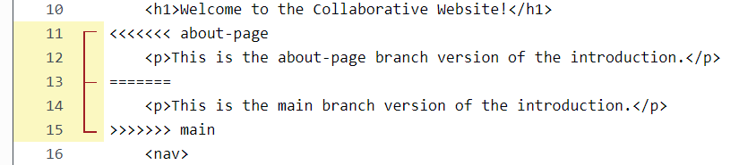

12. Here, you can edit this file, and remove the lines you don't want and keep the lines you want. In this case, we remove __line 11, 12, 13 & 15__. The `<<<<<<< about-page`, `=======`, and `>>>>>>> main` need to be removed as well. After editing, click __Mark as resolved__. Then click __Commit merge__. 
13. Now, in the active pull request, you will be able to merge the pull request. Click __Merge pull request__. Then you can delete branch as well. 

## Best practices for branching and merging 


