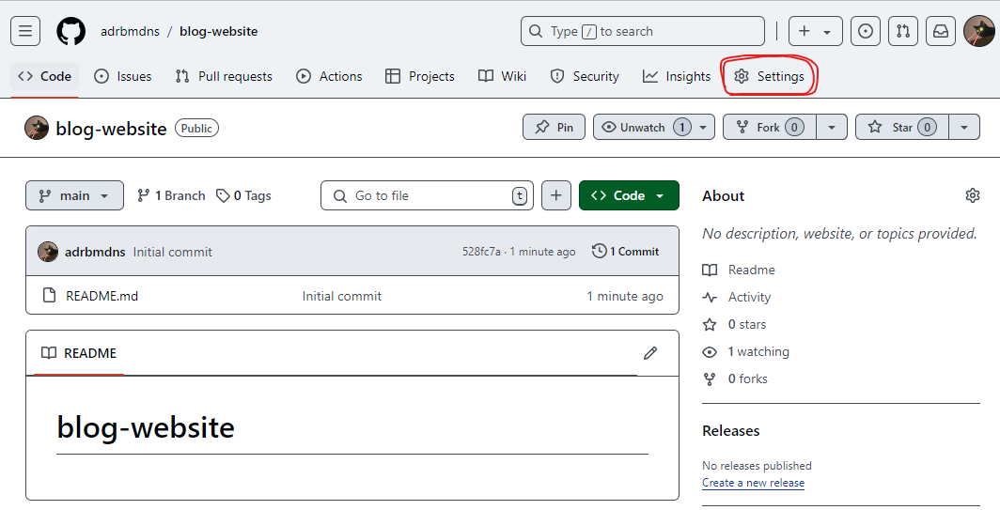
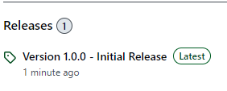

# Learning Module 3 - Collaborative Project 

Today we are going to work on a project in a group of three. You will start from scratch, from creating repo locally and on GitHub, invite collaborators, creating files, editing files, developing in branches, merging branches, resolving conflicts, and push to GitHub etc. 

This project is for developing a website. It will include writing some HTML, CSS, and JavaScript files. But don't worry, I will provide the code for these files. You only need to form the group, and discuss the task assignment, and start working on it. 

## Project Overview

In this project, the team will develop a basic blog website with the following features:
* __Homepage__: A main page that lists recent blog posts. 
* __Post Page__: A detailed page for each blog post with a comments section.
* __Admin Dashboard__: An interface for adding and managing blog posts. 

Each person will take responsibility for a specific component, but some parts will overlap, creating opportunities for collaboration and practice with branching and merging. Here's how the responsibilities divided:
* __Person 1__: Homepage development.
* __Person 2__: Post Page development. 
* __Person 3__: Admin Dashboard development. 

A __project leader__ also needs to be decided. The project leader will in charge of a few tasks on GitHub:
* Create the GitHub repo for the project.
* Invite group members to join the repo. 
* Review and merge pull requests. 

## Step-by-step guide 

### 1. Create a new repository `blog-website` on GitHub 

Project leader to create a new repository `blog-website` on GitHub. When creating, tick the option `Add a README file`.

### 2. Invite members to the repository

To invite others to join your repository:
* Go to your repo page, click __Settings__. 



* Click __Collaborators__ on the left pane. 
* Click __Add people__, then you can search the user and add them to the repository. 

### 3. Clone the repository to your local device 

All three team members need to clone this remote repository to their local device. Use the SSH address to clone the repo. 

### 4. Set up the basic project structure

A project needs to have a basic folder structure to begin with, otherwise everyone start writing code and save it to different folders and it's going to be a mess. 

__One of the group members__ to set up the basic project structure. The project structure indicates as follows. You only need to create the folder structure and empty files with names. You can use `mkdir <folder-name>` to create new folders and `touch <file-name>` to create empty files. 

The project structure is:

```txt
blog-website/
├── index.html         # Homepage
├── post.html          # Post page template
├── admin.html         # Admin dashboard
├── styles.css         # Shared CSS styles
└── scripts/
    ├── main.js        # Shared JavaScript
    ├── homepage.js    # JS for homepage
    ├── post.js        # JS for post page
    └── admin.js       # JS for admin dashboard
```

### 5. Push the initial structure to GitHub

After creating all folders and files, you can now make the initial commit and push it to GitHub.

### 6. Pull changes

One person has created the structure for the project and pushed it to GitHub, the other two people now can use __git pull__ to fetch the latest version of repo from GitHub to local.

### 7. Create branches

We have three tasks to do for the website development, so we will need three branches. Each person can create a branch for their development task. 

### 8. Work on separate tasks

Once you have created your own branch, you can switch to it and start working on it. I have all the codes for the files at the end of this document, and you can copy and paste while you developing. 

For __person 1 (Homepage)__, you need to work on these files:
* Develop `index.html`.
* Develop `homepage.js`.

For __person 2 (Post Page)__, you need to work on these files:
* Develop `post.html`.
* Develop `post.js`.

For __person 3 (Admin Dashboard)__, you need to work on these files:
* Develop `admin.html`.
* Develop `admin.js`. 
* Develop `styles.css`.

You should commit your changes to your branch regularly while developing, to avoid losing changes. 

### 9. Push branch to GitHub

After you have finishing all the development tasks for yourself, make the final commit and push your branch to GitHub. 

### 10. Submit a pull request

After pushing your branch to GitHub, you can submite a pull request for merging your branch to main, then waiting for the project leader to review your pull request. 

### 11. Review pull request

__Project leader__ to review pull requests and resolve any conflicts, then finally decide if you want to merge it to `main`. 

### 12. Final merge and testing 

Once all branches are merged, the team can pull the latest version of `main` and test the website locally to ensure everything works as expected. They can then push any last-minute fixes. 

## Release project 

Once the testing is complete and you are sure the project now is finished, you can make a release of the project on GitHub. What we have done so far for our `blog-website` project is not enough for an official release, if you are developing a real-world project and would like to release it for other people to use. You need to follow a more restricted test and documentation procedure. 

### 1. Tag the project with a version number 

To make a release of a project, you will need a version number, like we always see when we downloading software. The version format normally follows this rule: `vX.Y.Z` (e.g., v1.0.0). We also need to tag a version number to our project `blog-website`. 

```sh
git tag -a v1.0.0 -m "Initial release of Blog Website" 
```

### 2. Push the tag to GitHub

Push a tag to GitHub is like push a branch to GitHub:

```sh
git push origin v1.0.0
```

### 3. Create a GitHub release 

* Go to your GitHub repo.
* Click __Releases__ on the right sidebar. 
* Click __Draft a new release__.
* Click __Choose a tag__, select `v1.0.0`.
* In the "Release title" field, input "Version 1.0.0 - Initial Release".
* In the "Description" field, describe the release. Include details about new features, fixes, and any known issues. Here, we can input "Release of a blog website where you can upload your blogs and make comments!"
* Click __Publish release__. 

Now if you go back to the main page of your project, you will see there is an official release for your project. See image:



## Deploy website on GitHub

Since our project is a website, if we want others to be able to view it, we need to host this website on a server so everyone with internet can access it. Luckily, GitHub can host websites on their server for use so we don't need to rent our own server. To deploy a website to GitHub, we can do the following:

* Go to your GitHub repository `website-blog`.
* Go to __Settings__.
* Click __Pages__ on the left sidebar.
* Under __Source__, there is a dropdown, select "Deploy from a branch".
* Under __Branch__, there is a dropdown, select `main`, then another dropdown pop up, select `/(root)`, then click __Save__.

GitHub will now deploy your website, if you refresh your page, you will get a URL where GitHub hosts your website. Here, I got [https://adrbmdns.github.io/blog-website/](https://adrbmdns.github.io/blog-website/). And everyone will be able to view it. 

# Key takeaways

Key takeaways for today are:
* How to invite collaborators to your project
* How to release a project
* How to deploy a website on GitHub

# Q&A 

If you have any questions, please feel free to ask. Or you're always welcome to send an email to me at jiajia.li1@anu.edu.au 

# Workshop wrap-up 

For this 3 sessions workshop, we have covered the fundamental part of using Git version control software and GitHub cloud service. If you are learning Git for yourself and you will mostly work on a project by yourself, then the knowledge we have covered in this course are enough for your use. If you plan to work with others on a project, especially a bigger project, you may want to learn more. But I think these information are enough for you to get start with your project, and you can always learn as you go. 

Again, here I'm going to list all the things we have learned in this course:
* How to install Git to your computer
* How to create a GitHub account
* How to set up SSH keys on your computer
* How to create a new Git repository locally - `git init`
* How to create a new repository on GitHub
* How to add remote repository with local repository - `git remote add`
* How to clone a remote repository to local - `git clone`
* How to stage changes to Git - `git add`
* How to commit changes to Git - `git commit`
* How to push local commits to remote - `git push`
* How to sync remote changes to local - `git pull`
* How to create a branch - `git branch`
* How to switch branches - `git checkout`
* How to merge branches locally - `git merge`
* How to push local branches to remote - `git push origin <branch-name>`
* How to create pull requests on GitHub
* How to review pull requests, resolve conflicts, and merge branch on GitHub
* How to release a project on GitHub
* How to deploy a website on GitHub 

# Code Scripts

## 1. `index.html`

```html
<!DOCTYPE html>
<html lang="en">
<head>
    <meta charset="UTF-8">
    <meta name="viewport" content="width=device-width, initial-scale=1.0">
    <title>Blog - Home</title>
    <link rel="stylesheet" href="styles.css">
</head>
<body>
    <header>
        <h1>Welcome to the Blog</h1>
        <nav>
            <a href="admin.html">Admin Dashboard</a>
        </nav>
    </header>

    <main>
        <section id="blog-list">
            <h2>Recent Posts</h2>
            <!-- Blog posts will be loaded here by homepage.js -->
        </section>
    </main>

    <script src="scripts/homepage.js"></script>
</body>
</html>
```

## 2. `post.html`

```html
<!DOCTYPE html>
<html lang="en">
<head>
    <meta charset="UTF-8">
    <meta name="viewport" content="width=device-width, initial-scale=1.0">
    <title>Blog - Post</title>
    <link rel="stylesheet" href="styles.css">
</head>
<body>
    <header>
        <h1>Blog Post</h1>
        <a href="index.html">Back to Home</a>
    </header>

    <main>
        <article id="post-content">
            <!-- The post content will be loaded here by post.js -->
        </article>

        <section id="comments">
            <h3>Comments</h3>
            <!-- Comments will be loaded and submitted here -->
            <ul id="comment-list"></ul>
            <textarea id="comment-text" placeholder="Write a comment..."></textarea>
            <button id="submit-comment">Submit Comment</button>
        </section>
    </main>

    <script src="scripts/post.js"></script>
</body>
</html>
```

## 3. `admin.html`

```html
<!DOCTYPE html>
<html lang="en">
<head>
    <meta charset="UTF-8">
    <meta name="viewport" content="width=device-width, initial-scale=1.0">
    <title>Blog - Admin</title>
    <link rel="stylesheet" href="styles.css">
</head>
<body>
    <header>
        <h1>Admin Dashboard</h1>
        <a href="index.html">Back to Home</a>
    </header>

    <main>
        <section id="new-post">
            <h2>Create New Post</h2>
            <input type="text" id="post-title" placeholder="Post Title">
            <textarea id="post-content" placeholder="Post Content"></textarea>
            <button id="create-post">Create Post</button>
        </section>

        <section id="manage-posts">
            <h2>Manage Posts</h2>
            <ul id="post-list">
                <!-- List of posts for management will be loaded here -->
            </ul>
        </section>
    </main>

    <script src="scripts/admin.js"></script>
</body>
</html>
```

## 4. `styles.css`

```css
body {
    font-family: Arial, sans-serif;
    margin: 0;
    padding: 0;
    background-color: #f4f4f4;
    color: #333;
}

header {
    background-color: #0056b3;
    color: white;
    padding: 10px 0;
    text-align: center;
}

header h1 {
    margin: 0;
}

nav a {
    color: white;
    text-decoration: none;
    padding: 5px 15px;
    background-color: #003d7a;
    border-radius: 3px;
    margin: 5px;
}

nav a:hover {
    background-color: #002c59;
}

h2 {
    color: #0056b3;
}

main {
    padding: 20px;
}

section {
    margin-bottom: 20px;
}

textarea, input {
    width: 100%;
    padding: 10px;
    margin-bottom: 10px;
    border: 1px solid #ccc;
    border-radius: 4px;
}

button {
    background-color: #0056b3;
    color: white;
    padding: 10px;
    border: none;
    cursor: pointer;
    border-radius: 4px;
}

button:hover {
    background-color: #003d7a;
}
```

## 5. `scripts/main.js`

```js
// Shared JavaScript logic for the blog
```

## 6. `scripts/homepage.js`

```js
document.addEventListener("DOMContentLoaded", () => {
    const blogList = document.getElementById('blog-list');
    
    // Simulated blog post data
    const posts = [
        { title: "First Post", summary: "This is the first blog post", link: "post.html" },
        { title: "Second Post", summary: "This is the second blog post", link: "post.html" },
    ];

    // Dynamically load blog posts
    posts.forEach(post => {
        const postElement = document.createElement('div');
        postElement.innerHTML = `
            <h3><a href="${post.link}">${post.title}</a></h3>
            <p>${post.summary}</p>
        `;
        blogList.appendChild(postElement);
    });
});
```

## 7. `scripts/post.js`

```js
document.addEventListener("DOMContentLoaded", () => {
    const commentList = document.getElementById('comment-list');
    const submitCommentButton = document.getElementById('submit-comment');

    // Simulated post content
    const postContent = document.getElementById('post-content');
    postContent.innerHTML = "<h2>Sample Post Title</h2><p>This is the content of the post.</p>";

    // Comment submission functionality
    submitCommentButton.addEventListener('click', () => {
        const commentText = document.getElementById('comment-text').value;
        if (commentText) {
            const commentElement = document.createElement('li');
            commentElement.textContent = commentText;
            commentList.appendChild(commentElement);
            document.getElementById('comment-text').value = '';
        }
    });
});
```

## 8. `scripts/admin.js`

```js
document.addEventListener("DOMContentLoaded", () => {
    const postList = document.getElementById('post-list');
    const createPostButton = document.getElementById('create-post');

    // Simulated posts
    const posts = [];

    // Function to display posts
    const renderPosts = () => {
        postList.innerHTML = ''; // Clear the list before rendering
        posts.forEach((post, index) => {
            const postElement = document.createElement('li');
            postElement.innerHTML = `
                <h3>${post.title}</h3>
                <p>${post.content}</p>
                <button onclick="deletePost(${index})">Delete</button>
            `;
            postList.appendChild(postElement);
        });
    };

    // Create new post
    createPostButton.addEventListener('click', () => {
        const postTitle = document.getElementById('post-title').value;
        const postContent = document.getElementById('post-content').value;
        if (postTitle && postContent) {
            posts.push({ title: postTitle, content: postContent });
            renderPosts();
            document.getElementById('post-title').value = '';
            document.getElementById('post-content').value = '';
        }
    });

    // Delete post
    window.deletePost = (index) => {
        posts.splice(index, 1); // Remove the post
        renderPosts();
    };
});
```
